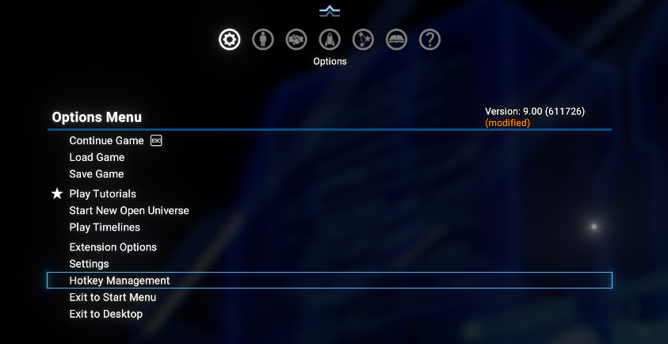
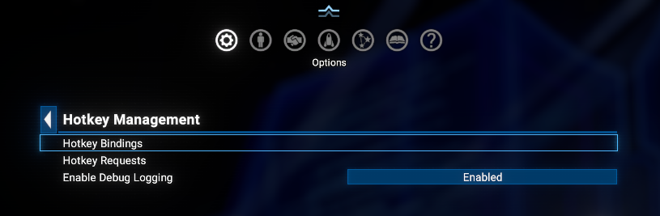
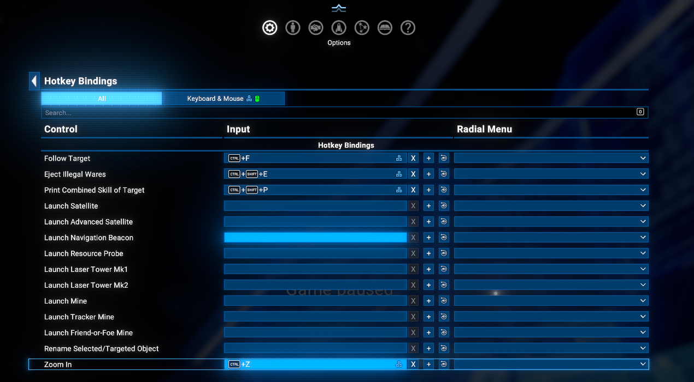
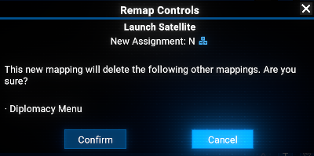
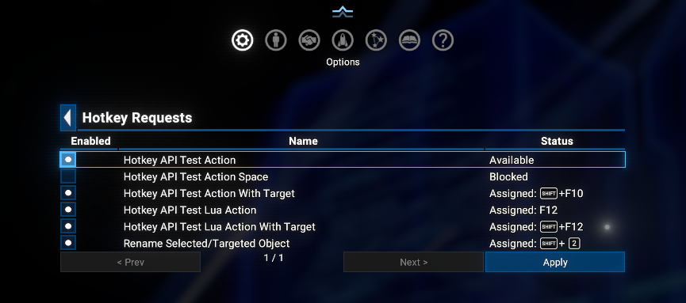

# Hotkey API

An API mod for X4: Foundations that lets other mods register custom hotkey actions - bindable by the player through the native game keybinding UI, with no external process and no dependency on *SirNukes Mod Support APIs*' own Hotkey API.

## Overview

Specifics of X4's input system: it uses specialized `INPUT_ACTION_*` enums to assign physical keys to in-game actions. These enums are compiled into the game and cannot be extended by mods.
This mod reclaims 48 otherwise-unused debug-only action slots and exposes them as a registration API: a consumer mod asks for an id, the framework hands it the next free slot from the pool, and the player assigns the actual physical key through the same native remap UI (and conflict-detection) every other control uses.
So, this mod will work till the Egosoft wil not remove the debug action slots from the game or will do anything else to break this functionality.

Two integration paths exist, both calling into the same registration/dispatch core:

- **MD API** - for Mission Director scripts. Uses `Register_Action` / `Reloaded` cue signals; the registered callback is an MD cue.
- **Lua API** - for Lua UI scripts. Call `HotkeyApi.RegisterAction(...)` directly; the registered callback is a Lua function, invoked with no MD/blackboard round trip at all.

A hotkey fires once, on press (no separate press/release/repeat events). Each registration declares a mandatory `area` (`'map'` and/or `'pilot'`, `;`-separated if both) describing where it's allowed to fire and what "selected object" means for it, and an optional `isObjectRequired` flag to skip firing when there's nothing selected/targeted.

## Requirements

- **X4: Foundations**: Version **8.00HF4** or higher and **UI Extensions and HUD**: Version **v8.0.4.9** or higher by [kuertee](https://next.nexusmods.com/profile/kuertee?gameId=2659).
  - Available on Nexus Mods: [UI Extensions and HUD](https://www.nexusmods.com/x4foundations/mods/552)
- **X4: Foundations**: Version **9.00** or higher and **UI Extensions and HUD**: Version **v9.0.0.6** or higher by [kuertee](https://next.nexusmods.com/profile/kuertee?gameId=2659).
  - Available on Nexus Mods: [UI Extensions and HUD](https://www.nexusmods.com/x4foundations/mods/552)

## Installation

- **Steam Workshop**: [Hotkey API](https://steamcommunity.com/sharedfiles/filedetails/?id=3750545906)
- **Nexus Mods**: [Hotkey API](https://www.nexusmods.com/x4foundations/mods/2181)

## Player-facing UI

A **Hotkey Management** entry is added to the top-level Options menu, right before **Settings**.



It contains:



- **Hotkey Bindings** - the actual keybinding page (native remap UI: click a row, press a key, confirm/replace on conflict). Conflicts are checked both against other hotkeys registered through this API and against vanilla bindings on other Controls pages.

  

  

- **Hotkey Requests** - lists every id any mod has tried to register this session, regardless of whether it currently holds a slot, with a checkbox per row:

  

  - **Checked** (default) - enabled; holds a slot if one was free when it last registered.
  - **Unchecked** - blocked: the slot (if any) and its key binding are freed immediately, available for some other id to claim.
  - Status column shows **Available** (holds a slot, no key bound yet), **Assigned: \<key\>** (holds a slot and a key), **Waiting (pool full)** (enabled, but all 48 slots were taken last time it tried), or **Blocked**.
  - Re-enabling a blocked id does not immediately reclaim a slot - press **Apply** to re-run registration for everyone (this also re-checks for orphaned slots, see Clearance below).
- A debug-logging toggle (**Enabled**/**Disabled**).

## MD API

### Flow

1. Your cue listens to  md.HotkeyApi.Reloaded
2. Call md.HotkeyApi.Register_Action with your own callback cue
3. Re-send Register_Action every time Reloaded fires again (cue references
   don't survive a Lua reload, so the registration itself doesn't either)
4. When the player presses the assigned key, your callback cue is signalled

### `Register_Action` - param fields

- `$id` *(string)* - unique identifier of this action, chosen by your mod. The same id always maps to the same physical hotkey slot once assigned.
- `$version` *(number, optional, default `1`)* - protocol version this request was built for. A version newer than this build supports is rejected outright rather than risk being silently misinterpreted.
- `$area` *(string, mandatory, no default)* - `'map'` and/or `'pilot'`, separated by `;` if both (e.g. `'map;pilot'`) - where the action is allowed to fire and what "selected object" means for `$isObjectRequired`. `'pilot'` means the player is piloting a ship (no menu open). Each area value has its own minimum supported `$version` (currently both `'map'` and `'pilot'` are available from version `1`) - a future area value added in a later version is only honored for a request that itself declares at least that version.
- `$isObjectRequired` *(bool, optional, default `false`)* - if `true`, the action is skipped unless a map selection (`'map'`) or ship target (`'pilot'`) is currently present.
- `$name` *(string)* - display name shown for this action's row on the Hotkey Bindings/Hotkey Requests pages.
- `$actionCue` *(cue reference)* - signalled when the hotkey fires and any target requirement is satisfied. Receives `param = table[$id = id]`, plus `$object` (an MD component reference) if a selection/target was present.

### Debug logging (`GetDebugChance`) - recommended for cue-based consumers

A shared library, `include_actions ref="md.HotkeyApi.GetDebugChance"`, computes `$debugChance` (`0` or `100`) from the player's current debug-logging preference (toggled from the Hotkey Requests page). Any cue - in this mod or a consumer's - can include it once and then use `chance="$debugChance"` on its own `debug_text` calls, so toggling the option silences everything in lockstep instead of each mod tracking its own flag. Cross-extension references must be fully qualified (`ref="md.HotkeyApi.GetDebugChance"`) - MD library references are namespaced per-script, not globally bare-addressable.

### Usage example MD

```xml
<cue name="Register_My_Action" instantiate="true">
  <conditions>
    <event_cue_signalled cue="md.HotkeyApi.Reloaded" />
  </conditions>
  <actions>
    <signal_cue_instantly
      cue="md.HotkeyApi.Register_Action"
      param="table[
        $id               = 'my_mod_my_action',
        $area             = 'map;pilot',
        $isObjectRequired = false,
        $name             = 'My Action',
        $actionCue        = My_Action_Cue,
        ]"/>
  </actions>
</cue>

<cue name="My_Action_Cue" instantiate="true" namespace="this">
  <conditions>
    <event_cue_signalled />
  </conditions>
  <actions>
    <debug_text text="'My action fired! param: %s'.[event.param]" chance="100" filter="general" />
  </actions>
</cue>
```

## Lua API

### Flow (Lua)

1. Listen for the "HotkeyApi.Register_Request" event (raised every time
   md.HotkeyApi.Reset_On_Lua_Reload fires - mirrors MD's Reloaded cue)
2. Call HotkeyApi.RegisterAction({...}) in response, every time
3. Your actionLua function is called directly when the assigned key is
   pressed - no MD/blackboard round trip at all

### `HotkeyApi.RegisterAction` - request fields

Same fields as MD's `Register_Action` (using plain Lua values, no `$` prefix), plus:

- `actionLua` *(function)* - called as `actionLua({id, object})` when the hotkey fires and any target requirement is satisfied. `object` is the selected/targeted component id (a real Lua value, not a blackboard round trip), or `nil` if there wasn't one.

Either or both of `actionCue` and `actionLua` may be set on the same registration; if both are set, only `actionLua` fires (MD dispatch is skipped).

### Usage example Lua

```lua
RegisterEvent("HotkeyApi.Register_Request", function()
  HotkeyApi.RegisterAction({
    id = "my_mod_my_action",
    area = "map;pilot",
    isObjectRequired = false,
    name = "My Lua Action",
    actionLua = function(params)
      DebugError("My action fired! id: " .. tostring(params.id))
    end,
  })
end)
```

## Orphaned-slot reclaiming (Clearance)

Every slot loaded from a previous session starts each reload marked unconfirmed; registering again marks it confirmed. Ten seconds after every `Reloaded` broadcast (long enough for every consumer to have responded), a `Clearance` sweep clears the key binding and frees the slot of anything still unconfirmed - e.g. a mod that was removed, or stopped registering that id. This runs automatically; no action needed from consumers.

## Limitations

- **48-action hard ceiling.** `INPUT_ACTION_*` is a closed enum compiled into the game; this pool cannot be extended.
- **Cross-page conflict checking is conservative, not area-aware.** Remapping one of this pool's keys checks for conflicts against every other Controls page, regardless of the hotkey's own `area` - this was deliberately simplified after testing showed per-area filtering wasn't reliable to scope correctly.
- Loading a save without some of the mods that registered hotkeys will clear their slots and key bindings, so the player will have to reassign them when they reload with those mods again.
- The keybindings in X4 are not saved in the save file, but stored per "profile". Please note that the keybindings created for one game will be "replicated" to any other save using the same profile.

## Credits

- **Author**: Chem O`Dun, on [Nexus Mods](https://next.nexusmods.com/profile/ChemODun/mods?gameId=2659) and [Steam Workshop](https://steamcommunity.com/id/chemodun/myworkshopfiles/?appid=392160)
- *"X4: Foundations"* is a trademark of [Egosoft](https://www.egosoft.com).

## Acknowledgements

- [EGOSOFT](https://www.egosoft.com) - for the X series.
- [kuertee](https://next.nexusmods.com/profile/kuertee?gameId=2659) - for the `UI Extensions and HUD` that makes the generic callback hooks this mod relies on possible.

## Changelog

### [8.00.01] - 2026-06-23

- **Added**
  - Initial version: 48-action pool, MD and direct-Lua registration paths, Hotkey Management/Bindings/Requests pages, cross-page conflict checking, debug-logging toggle, orphaned-slot Clearance sweep, request versioning.
